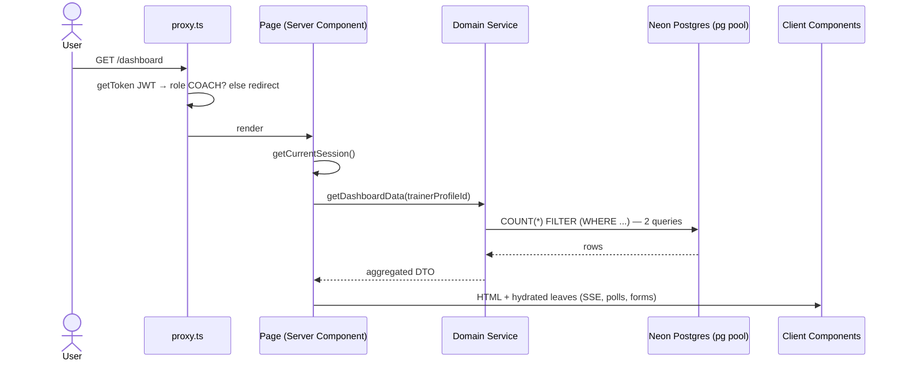
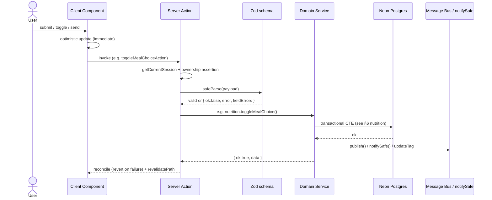

# CoachFlow — Architecture & Structure

## 1. Plain-Language Summary

CoachFlow is a monolithic **Next.js 16 App Router** application. The same codebase serves three front-ends (admin console, coach dashboard, client mobile-first portal) plus 16 HTTP API routes, all running as Vercel serverless functions against a single Neon Postgres database.

Key architectural choices:
- **Server-first rendering:** pages are React Server Components that fetch data on the server — almost no client-side data fetching loops.
- **Mutations via Server Actions:** client components call Server Actions; actions validate with Zod, dispatch to domain services, then revalidate pages.
- **Service layer:** ~30 domain services in `src/server/services/` own all business rules and SQL.
- **Raw SQL over ORM at runtime:** all live queries go through the `pg` pool (`src/lib/db.ts`) with positional parameters (`$1, $2…`). Prisma provides only schema + migrations.
- **Distributed-by-default with safe fallbacks:** Redis pub/sub (SSE), Upstash rate limiting, R2/S3 storage, and a read replica all degrade gracefully when their env vars are unset, so local dev runs on Postgres alone.

## 2. System Architecture Diagram

```mermaid
flowchart TD
    Browser[Coach / Athlete Browser] --> Edge[Next.js Proxy\nsrc/proxy.ts\nJWT role gate + locale cookie]
    Edge --> Pages[App Router Pages\nRSC: (admin) (trainer) (auth)\nclient/(portal) client/(session)\ninvite/join]
    Edge --> API[API Routes\nsrc/app/api/*]

    Pages -->|read| Services[Domain Services\nsrc/server/services/*]
    Pages -->|mutate| Actions[Server Actions\nsrc/server/actions/*]
    Actions --> Zod[Zod Validation\nsrc/lib/validations/*]
    Actions --> Services

    Services --> Pool[(Neon Postgres primary\npg pool, max 5/10, 15s timeout)]
    Services -.->|heavy reads| Replica[(Neon read replica\nDATABASE_URL_REPLICA)]
    API --> Bus[Message Bus\nsrc/server/realtime/message-bus.ts]
    Bus --> Redis[(Redis pub/sub\nREDIS_URL)]
    Bus -.->|fallback| MemBus[In-memory EventEmitter]
    Actions -->|publish| Bus
    API -->|subscribe| SSE[SSE stream\n/api/messages/stream]
    SSE --> Browser
    Services --> Storage[Cloudflare R2 / S3\n+ Postgres BYTEA fallback]
    Services --> Cache[unstable_cache\ntag invalidation]
    Cron[Vercel Cron 0 6 * * *\n/api/automation/run] --> Jobs[src/server/automation/jobs.ts]
    Jobs --> Pool
```

## 3. Folder / File Structure

```
src/
├── proxy.ts                    # Edge middleware (auth/role routing, ghost-session cleanup, locale)
├── app/                        # Next.js App Router routes + layouts
│   ├── layout.tsx              # Root layout: fonts (Geist/Alexandria), providers, viewport metas
│   ├── globals.css             # Tailwind base + fitness design tokens (brand/energy/muscle/performance)
│   ├── page.tsx                # Root: role-based redirect (/admin, /dashboard, /client/home, /login)
│   ├── (auth)/                 # login, register, signout
│   ├── (admin)/admin/          # SUPER_ADMIN: dashboard, trainers (+[id]), clients, subscriptions
│   ├── (trainer)/              # COACH: dashboard, clients (+[id] deep routes), messages,
│   │                           #   notifications, onboarding, settings, nutrition-templates,
│   │                           #   training-split-templates, subscription-plans, blog
│   ├── client/(portal)/        # CLIENT shell (bottom-nav layout): home, week, workout/today,
│   │                           #   nutrition, messages, media, notifications, profile, blog
│   ├── client/(session)/workout/session # Distraction-free active workout logger
│   ├── client/{login,change-password}   # Athlete auth entries
│   ├── invite/[token]/ (+/success)      # Public 3-step onboarding wizard
│   ├── join/[slug]/            # Stable coach public landing page
│   ├── subscription/           # Coach SaaS paywall (expired license)
│   └── api/                    # 16 route handlers (see API.md)
├── components/
│   ├── brand/                  # BrandLogo (dynamic per-coach branding)
│   ├── branding/               # BrandingProvider (single instance, live-sync via window events)
│   ├── features/               # Domain UI: admin, auth, blog, body-composition, checkin, client,
│   │                           #   clients, dashboard, goals, invite, join, media, messages,
│   │                           #   notifications, nutrition, onboarding, progress, search,
│   │                           #   sessions, settings, subscription, subscription-plan, training-split
│   │                           #   (+ training-split/liquid-glass primitives)
│   ├── layout/                 # AppTopNav, WelcomeTicker, TrainerBottomNav, theme/language toggles
│   ├── providers.tsx           # SessionProvider, LocaleProvider, direction, Toaster
│   ├── motion/ shared/ theme/ ui/   # Animation helpers, shared bits, shadcn/ui primitives,
│   │                                # custom fitness widgets (ProgressRing, FitnessCard, …)
├── server/
│   ├── auth.ts                 # NextAuth options, authorize(), JWT/session callbacks,
│   │                           #   60s in-memory caches, Upstash rate limiter (+memory fallback)
│   ├── actions/                # 26 Server Action files (mutations; see API.md §3)
│   ├── services/               # 30 domain service files (business logic + SQL)
│   ├── automation/jobs.ts      # Advisory-locked cron jobs (expiry, milestones, reminders)
│   └── realtime/message-bus.ts # Redis Pub/Sub (conversation:{id}) + EventEmitter fallback
├── lib/
│   ├── db.ts                   # pg pools, retry, replica, helpers, generateId, error classifiers
│   ├── prisma.ts               # PrismaClient singleton — NOT imported anywhere at runtime
│   ├── cache.ts                # unstable_cache wrapper + updateTag invalidation
│   ├── storage.ts              # S3/R2 client (presigned URLs) w/ BYTEA fallback
│   ├── logger.ts               # Structured JSON/NDJSON logger + dev formatting
│   ├── auth.ts                 # bcrypt hash/compare helpers
│   ├── exercise-safety.ts      # Pain-flag × exercise rule matrix (findConflicts)
│   ├── checkin.ts / goals.ts / needs-action.ts   # Pure domain math (streaks, progress, triage)
│   ├── logo-image.ts           # Magic-byte sniff + Sharp WebP pipeline
│   ├── whatsapp.ts             # Egyptian phone normalization, template interpolation, wa.me URLs
│   ├── i18n/                   # Locale config (ar default), EN/AR dictionaries, getI18n()
│   ├── validations/            # 22 Zod schema files (boundary validation)
│   ├── db/{enums,types}.ts     # Client-safe mirrored enums + relational row types
│   ├── calculations/           # week-schedule, workout-schedule, session-progress
│   └── constants/ utils/ messages/  # tabs, video helpers, chat suggestions
├── hooks/                      # Client hooks (e.g. useUnreadCount)
└── types/                      # Shared TS types
```

Supporting top-level dirs: `prisma/` (schema, 32 migrations, seed), `scripts/` (demo seeding, media migration, one-off tools), `tests/` (17 test files).

## 4. Request & Data Flow

### 4.1 Page read (RSC)



Tenant isolation happens in the service: every query carries `WHERE "trainerId" = $1` bound to the session's `trainerProfileId` (clients use `session.user.clientProfileId` / `session.user.id`).

### 4.2 Mutation (Server Action)



Every action returns the standard contract `{ ok: true, data } | { ok: false, error, fieldErrors? }` — forms map `fieldErrors` straight into react-hook-form.

### 4.3 Real-time chat (SSE + polling)

`GET /api/messages/stream?conversationId=` → session + conversation ownership check → `ReadableStream` with `subscribe(conversationId, send)` from the message bus, `data:` frames + `: heartbeat` every 25s. `sendMessageAction` inserts the row, updates `lastMessageAt/preview`, then `publish(conversationId, msg)` — Redis fans it out across instances (or the local emitter in dev). Client `ChatThread` also polls (3s visible / 10s hidden) and dedupes via a seen-set, so chat survives SSE drops.

## 5. Key Design Patterns (and why)

| Pattern | Where | Why |
|---|---|---|
| Layered RSC architecture (proxy → RSC → actions → services → SQL) | Whole app | Server-rendered HTML with zero client data-fetching; single mutation boundary |
| Raw `pg` at runtime, Prisma as schema tooling | `src/lib/db.ts`, `prisma/` | Postgres-specific speedups (`FILTER` counts, CTEs, window functions) that the ORM cannot express; Prisma keeps migrations declarative |
| Lazy `Proxy` pools | `db.ts makeLazyPool()` | Pool is created on first query — importing `db` never throws when `DATABASE_URL` is unset (CI build, health route) |
| Transient-error retry (`withDbRetry`) | `db.ts` (timeouts, DNS, cold starts, `AggregateError` unwrap) + `getDbMetrics()` | Neon cold-start resilience |
| Read/write split | `replicaQuery*` → `DATABASE_URL_REPLICA` | Keeps analytics off the primary transaction pool |
| Template → client **deep-copy** with two-pass UUID remap | `nutrition.service.insertMealsForPlan` | Active client plans are snapshots — template edits never corrupt live programs; `replacesMealId` links survive the copy |
| Mutual-exclusivity CTE | `nutrition.toggleMealChoice` | One selectable option per meal group enforced in the DB, not the UI |
| Computed-on-read triage (7 batched queries → pure evaluator) | `needs-action.service` + `lib/needs-action.ts` | No stale alerts table to maintain; feed is always current, ranked HIGH > MEDIUM > LOW |
| i18n-on-read notifications | `titleKey/bodyKey/params` JSON in DB, translated at render | One row serves ar/en; locale switching needs no backfill |
| Cursor pagination (`(createdAt, id)` tuples) | notifications, messages | Stable paging under concurrent inserts (no OFFSET drift) |
| Ghost-session self-healing (JWT `token.role = undefined` → proxy clears cookies) | `auth.ts`, `proxy.ts` | Survives DB resets/seed wipes without redirect loops or empty shells |
| Graceful degradation everywhere | bus, rate limiter, storage, `Promise.allSettled` profile loads | Every optional subsystem has an in-process fallback; the app runs on Postgres alone |
| Idempotent cron (advisory lock + `dedupeKey ON CONFLICT DO NOTHING`) | `automation/jobs.ts` | Safe under concurrent/repeated scheduler invocations |
| SSE primary + adaptive polling fallback | `chat-thread.tsx` | Real-time without WebSocket server state; works serverless |
| Optimistic UI with server reconcile | meal toggles, chat send | Feels instant; server remains the authority |

## 6. Core Modules Deep-Dive

### 6.1 Auth — `src/server/auth.ts` (558 lines)

- **Provider:** `next-auth@4` `CredentialsProvider` only (username **or** phone **or** email + password). No OAuth — Egyptian coaches/athletes often lack international-email infrastructure.
- **Session:** encrypted JWT, `maxAge` 30 days, `HttpOnly` cookie (`__Secure-next-auth.session-token` on https, else `next-auth.session-token`); `VERCEL_URL` auto-sets `NEXTAUTH_URL`.
- **Login flow (`authorize`):** `checkLoginRateLimit` → single `SELECT * FROM "User" WHERE username=$1 OR phone=$1 OR email=$1` → `bcrypt.compare` → on success resolve profile ids; suspended coaches throw `ACCOUNT_SUSPENDED`. Self-heals a missing `TrainerProfile` by auto-creating one (plus dashboard-tag bust).
  - "DUAL AUTH PATH NOTE" in code: legacy `Client.passwordHash/email` fields are invite-flow only — `User` is the sole credential path.
- **JWT callback:** three 60s in-memory caches (`nameCache`, `trainerValidationCache`, `clientValidationCache`) so every RSC request doesn't re-hit the DB; revalidates profile ids and sets `token.role = undefined` for ghost sessions (deleted DB rows) which the proxy turns into a clean logout.
- **Rate limit:** `Upstash Ratelimit.slidingWindow(5, "15 m")` keyed `coachflow:ratelimit:login` on the normalized identifier; memory sliding-window fallback (`5 failures / 15m window / 15m lockout`).
- **Public exports:** `authOptions`, `getCurrentSession()` (React-`cache`d `getServerSession`), `checkLoginRateLimit`, `recordLoginFailure/Success`, `invalidateNameCache`.

### 6.2 Request gate — `src/proxy.ts`

- Next.js **proxy convention** (not `middleware.ts`): `getToken` with dual cookie-name fallback, then:
  - Cookie present but token undecryptable/roleless → clear both cookies; redirect protected paths to `/login` (kills `ERR_TOO_MANY_REDIRECTS` after secret rotation), let auth pages render.
  - Logged-in users hitting `/login|/register|/client/login` → role home (`/admin`, `/dashboard`, `/client/home`).
  - `TRAINER_PATHS` require `COACH`; `CLIENT_PATHS` require `CLIENT`; `/admin*` requires `SUPER_ADMIN`; `/` redirects by role.
- Locale: callers set the `locale` cookie (default `ar`); `getI18n()` reads it server-side.
- Matcher excludes `api`, `_next/*`, favicon, and static image extensions — API routes enforce their own session checks.

### 6.3 Database core — `src/lib/db.ts` (335 lines)

```ts
pool: Pool                                   // lazy Proxy; primary writes + reads
replicaPool: Pool                            // DATABASE_URL_REPLICA, falls back to primary
query<T>(text, params?)                      // retry-wrapped pool.query
queryOne<T>(text, params?): Promise<T|null>
queryMany<T>(text, params?): Promise<T[]>
replicaQuery / replicaQueryOne / replicaQueryMany   // same, against replica
execute(text, params?): Promise<number>      // rowCount
withTransaction<T>(fn): Promise<T>           // BEGIN / COMMIT / ROLLBACK on one client
txQueryOne / txQueryMany / txExecute         // transaction-scoped helpers
generateId(): string                         // 'c' + 24 hex chars from randomUUID
healthCheck(): Promise<boolean>
getDbMetrics(): { totalRetries, totalRetryFailures, hasReplica }
isUniqueViolation(err) / isForeignKeyViolation(err)  // 23505 / 23503 classifiers
```

Pool config: `max 5` (serverless) / `10` (local), `statement_timeout: 15_000`, `uselibpqcompat=true` auto-append, `rejectUnauthorized:false` TLS on serverless.

### 6.4 Real-time bus — `src/server/realtime/message-bus.ts`

`subscribe(conversationId, listener): unsubscribe` (reference-counted — one Redis `SUBSCRIBE` per channel per instance) and `publish(conversationId, data)` (`PUBLISH conversation:{id}` JSON; local emitter when no `REDIS_URL`). Used only for chat fan-out.

### 6.5 Coach operations

- **Dashboard** (`dashboard.service.getDashboardData(trainerId)`): the KPI read path — 2 parameterized queries (`COUNT(*) FILTER (WHERE status=…)` + 5 newest clients), cached 300s under `trainer:{id}:dashboard`, busted by `invalidateDashboard(trainerId)` (`updateTag`). Returns zeroed defaults on DB failure.
- **NeedsAction** (`needs-action.service` + `lib/needs-action.ts`): 7 batched queries (last workout, subscriptions/expiry, last InBody, pending proofs, last check-in, pending media, goal deadlines) → `evaluateClientActions` pure evaluator → 10-rule ranked feed (`inactive_5d`, `sub_expired`, `payment_pending` = HIGH; …; `no_inbody`, `checkin_today` = LOW).
- **CRM** (`client.service`): tenant-scoped search by name/phone/goal with pagination; the athlete profile page (`/clients/[id]`) renders 6 sections (Overview, Check-ins, Workout, Nutrition, Progress, Subscription) via a sticky `SectionNav`; heavy sections load with `Promise.allSettled` so one cold-start failure doesn't blank the page.
- **Onboarding** (`invite.service`): `createClientInvite` (nanoid(24), 7-day expiry, status `INVITED`) → 3-step public wizard (`submitClientBasicInfo` → `PENDING_ASSESSMENT` → optional InBody `BodyComposition` → `submitClientAccountInfo` creates `User`, nulls token, status `ACTIVE`); `createLoginForClient` for direct provisioning (`mustChangePassword=true`); stable join slugs with 24h `previousInviteSlug` grace.
- **Search** (`actions/search.ts → globalSearchAction`): parallel tenant-scoped SQL across clients, exercises, workout/nutrition templates, blog posts — powers the `Cmd+K` palette.

### 6.6 Training (`training-split.service`, `week.service`, `lib/exercise-safety.ts`)

- Templates (`TrainingSplitTemplate → Day → TemplateDayExercise`) are authored once, then **deep-copied** (`applyTemplateToClient`) into client-owned `TrainingSplit → TrainingSplitDay → SplitDayExercise`; subsequent template edits never touch live splits.
- Editing a split **with** existing `ExerciseLog`s versions the split (history preserved) instead of mutating in place (see `tests/split-versioning.test.ts`); without logs it updates in place.
- Scheduling: `FIXED_WEEKDAYS` (explicit `Weekday` per day, Saturday-first for Egypt) vs `SEQUENTIAL` (rotation derived from the latest `ExerciseLog`).
- Safety: `findConflicts(exercises, painFlags)` maps `neck/shoulder/back/kneePain` to risky keywords → `SafetyWarningDialog` with one-click substitutes.
- Session logging persists per-set JSON (`setData: [{set,reps,weightKg,rpe}]`) plus denormalized `actualSets/Reps/WeightKg`.
- `WorkoutDisplayMode.DAY_NAME_ONLY` redacts targets/CTAs across the client portal (FULL locks nothing).

### 6.7 Nutrition (`nutrition.service` — largest service, 34KB)

- Templates (`NutritionTemplate → Meal → MealItem`, `SupplementDef`, `SubstituteGroup → SubstituteItem`) deep-copy to `ClientNutritionPlan` snapshots via `copyTemplateToPlanInTx` with the **two-pass UUID remap** (`idMap` then translate `replacesMealId`).
- **Alternative meals:** main (`isSpare=false`) ↔ alternates (`isSpare=true, replacesMealId=<main>`). Key functions: `createNutritionTemplate`, `updateNutritionTemplate`, `deleteNutritionTemplate`, `assignTemplateToClients`, `refreshPlanFromTemplate`, `getCachedActivePlanFull`, `savePlanContent`, `getPlanHistory`, `toggleMealChoice(clientId, mealItemId)`, `getTodayMealChoices`.
- Client toggle executes a CTE: resolve the target's meal cluster (main + all alternates), delete that day's `MealChoice`s in sibling meals, upsert the item — intra-meal multi-checking allowed, cross-meal exclusivity hard-enforced. New devs: never bypass this with direct inserts.
- Legacy `MealItem.groupNumber` ("Option Groups") was dropped (migration `20260914100000_drop_meal_item_group_number`) — do not reintroduce.

### 6.8 Progress & gamification

- `body-composition.service`: append-only `BodyComposition` time-series (coach or client source); UI computes deltas between last two scans.
- `progress.service` + `getCachedStrengthSeries` (hour-cached, replica-routed): estimated 1RM/peak trends from `ExerciseLog`.
- `media.service`: photo/video lifecycle `PENDING → REVIEWED`; list queries blank `storageUrl` and fetch bytes on demand.
- `goal.service` + `lib/goals.ts`: 6 `GoalType`s, direction-aware `%` math, auto-sync of WEIGHT/BODY_FAT/MUSCLE goals from latest InBody; goals are never deleted, only re-statused.
- `checkin.service` + `lib/checkin.ts`: `DailyLog` deduped by `@@unique([clientId, date])`; `calcStreak` walks ≤400 days back; milestones (3/7/14/30/60/90/365) fire `CelebrationBurst`.

### 6.9 Money & automation (`subscription.service`, `payment-proof.service`, `coach-subscription.service`, `automation/jobs.ts`)

- Client packages: `PERIOD` (calendar expiry) vs `SESSIONS` (`sessionsCount/remainingSessions`, decremented by coach action). Lifecycle `NONE → ACTIVE ⇄ TRIAL/PAUSED → EXPIRED`.
- Payment proofs (`PENDING → APPROVED → REJECTED`): approval flips `Subscription.paymentStatus=PAID`. No card gateway — screenshots of Instapay/Vodafone Cash.
- Platform licenses: `CoachSubscription` + `PaymentRecord` (admin-managed); `checkCoachSubscriptionAccess` redirects expired coaches to the `/subscription` paywall.
- Cron (`runAutomationJobs`): advisory lock → expire overdue PERIOD plans + T-7/T-3/T-1/T-0 reminders + inactivity/check-in nudges, each guarded by `dedupeKey ON CONFLICT DO NOTHING`.

### 6.10 Notifications, presence, branding, content

- `notification.service`: `notifySafe` (never throws), `notifyClientsPlanUpdated`, cursor-paginated `listNotifications`, `countUnreadNotifications`, read markers; 15 `NotificationType`s; admin data is i18n keys + params.
- `presence.service`: `PresenceSession` heartbeats (online-now tracking).
- `branding.service`: per-coach `CoachBranding` (name, color, logo/avatar URLs, socials) with anti-XSS validation (hex-only colors, blocked `url(`/`javascript:` payloads, data-URL length cap); `storeCoachLogoFile` (partial-upsert — load-bearing for schema drift) → magic-byte sniff → Sharp WebP → versioned `?v=` URL; single `BrandingProvider` live-synced via `branding:updated` window events.
- `blog.service`: `CoachPost` + `PostImageFile` (TRANSFORMATION/TRAINING/NUTRITION/TIPS/EDUCATION/GENERAL), lazy-loaded editor.

### 6.11 Shared libs new devs must know

- `lib/cache.ts`: `withCache(fn, keys, tags, ttl)` = `unstable_cache` shorthand; `invalidateDashboard(id)` is the write-side contract — call it after coach-facing mutations.
- `lib/storage.ts`: `uploadBufferToStorage / getPresignedDownloadUrl / getPresignedUploadUrl / deleteFromStorage`; `scripts/migrate-media-to-storage.ts` one-time BYTEA → R2 offload.
- `lib/logger.ts`: NDJSON in prod, human-readable in dev; `getDbMetrics()` feeds retry observability.
- `lib/whatsapp.ts`: `normalizeEgyptianPhone` (`01…` → `201…`), `interpolateTemplate`, `buildWhatsAppUrl`; WhatsApp expiry templates live in `SystemSetting.admin_whatsapp_templates` (self-healing `CREATE TABLE IF NOT EXISTS`).
- `lib/i18n/`: `getLocale()` (cookie, default `ar`), `getDictionary`, cached `getI18n()` → `{ locale, dir, t }`; dictionaries `messages/ar.ts|en.ts`.
- `lib/validations/` (22 files): every action input's Zod gate; `lib/db/enums.ts` + `types.ts` are the client-safe TypeScript mirrors of the Prisma enums/rows.
- `lib/calculations/`: week/workout/session schedule math covered by unit tests.

## 7. Business Rules Checklist (read before touching code)

1. Scope **every** client query by `trainerId`; clients may only touch their own rows (assert via `assertClientOwnedByTrainer` / `session.user.*ProfileId`).
2. Actions return `{ ok, error?, fieldErrors? }` — never throw user-facing errors.
3. Template edits must not touch assigned plans; plan edits go through `savePlanContent`; splits with logs version, never mutate.
4. Meal toggles must go through `toggleMealChoice` — the CTE is the exclusivity guarantee.
5. New coins/IDs: `generateId()` (`c` + 24 hex), invite tokens `nanoid(24)`.
6. Passwords: `bcrypt.hash(…,10)`; forced-change flow via `mustChangePassword`.
7. Dates: `@db.Date` UTC-midnight + `@@unique([clientId, date])` is the dedupe primitive — reuse it.
8. Notifications: store `titleKey/bodyKey/params`, never rendered strings; include a `dedupeKey` for cron-generated rows.
9. Dashboard cache: call `invalidateDashboard(trainerId)` on coach-visible mutations.
10. Uploads: magic-byte sniff first, Sharp→WebP second, versioned URLs third; never trust client MIME types.
