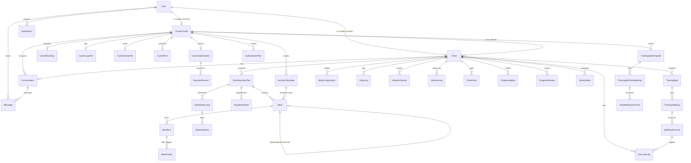

# CoachFlow — Database Schema

- **Engine:** PostgreSQL 15+ on Neon Serverless. Pooled endpoint (`-pooler`), `uselibpqcompat=true` auto-appended, 15s statement timeout.
- **Definition:** `prisma/schema.prisma` — **41 models, 28 enums**, 32 migrations in `prisma/migrations/`.
- **Access:** runtime = raw parameterized `pg` (`src/lib/db.ts`); Prisma = schema + migrations only (see [ARCHITECTURE.md §5](ARCHITECTURE.md)).
- **IDs:** relational rows use `generateId()` (`c` + 24 hex from `randomUUID`); invite tokens use `nanoid(24)`.

## 1. ER Diagram

## 2. Models by Domain

### 2.1 Identity & tenancy

| Model | Key fields | Notes |
|---|---|---|
| `User` | `id`, `username?`ⓤ, `phone?`ⓤ, `email?`ⓤ, `passwordHash`, `role` (`SUPER_ADMIN/COACH/CLIENT`), `mustChangePassword` | Sole credential table; index `[role]` |
| `TrainerProfile` | `userId`ⓤ→User(cascade), `fullName`, `phone`, `email?`, `businessName?`, `units` (METRIC/IMPERIAL), `weekStartDay` (SAT/SUN/MON), `timezone?`, `accountStatus` (ACTIVE/SUSPENDED), `inviteSlug?`ⓤ, `previousInviteSlug?`ⓤ+expiry, notify prefs | Coach tenant root — every client query scopes here |
| `Client` | `trainerId`→Trainer(cascade), `userId?`ⓤ→User, `fullName?`, `birthDate?`, `phone?`, `email?`, `goals Goal[]`, `status` (INVITED→PENDING_ASSESSMENT→ACTIVE→PAUSED→COMPLETED→ARCHIVED), `inviteToken?`ⓤ+expiry, legacy `passwordHash?`, pain flags (`neck/shoulder/back/kneePain`), `coachingMode` (ONLINE/IN_PERSON), `workoutDisplayMode` (FULL/DAY_NAME_ONLY) | Indexes `[trainerId]`, `[status]` |

ⓤ = unique. Delete behavior: `Client` cascades under its trainer; `User.clientProfile` has no cascade (client keeps history if login removed).

### 2.2 Nutrition (templates → deep-copied plans)

| Model | Key fields | Notes |
|---|---|---|
| `NutritionTemplate` | `trainerId?` (null = platform-owned), `isGlobal`, macros (`calories`, `protein/carbs/fatsGrams`, `waterLiters`), `coachMessage`, `guidelines/avoidFoods/recommendedFoods` string[] | Blueprint; never mutated by assignment |
| `ClientNutritionPlan` | `clientId`→cascade, `templateId?` (provenance only), same macro fields, `status` (DRAFT/ACTIVE/PAUSED/COMPLETED), `startDate/endDate` | Snapshot: template edits never propagate |
| `Meal` | `templateId?` **xor** `planId?` (cascade both), `kind` (MEAL/SNACK), `order`, `name/nameAr`, `isSpare`, `replacesMealId?` | Alternate = `isSpare=true` + `replacesMealId`→main meal's id |
| `MealItem` | `mealId`→cascade, `foodName/foodNameAr`, `amount`, `unit` (G/ML/PCS), `calories?`, `order` | |
| `MealChoice` | `clientId`→cascade, `mealItemId`→cascade, `date @db.Date` | `@@unique([clientId, mealItemId, date])` = no double-logging; index `[clientId, date]` |
| `SupplementDef` | `templateId?/planId?`→cascade, bilingual `name/definition/importance` + `order` | Guide, not inventory |
| `SubstituteGroup` / `SubstituteItem` | `category` (CARB/PROTEIN/FAT/FRUIT), `caloriesLabel`, items with `amount/unit/order` | 4-tier substitution tables |

### 2.3 Training (templates → deep-copied splits, versioned edits)

| Model | Key fields | Notes |
|---|---|---|
| `Exercise` | `name`ⓤ, `nameAr?`, `muscleGroup`, `equipment?`, `tags[]` (drives safety matrix), defaults, `youtubeUrl?`, `isGlobal` | Bilingual dictionary seeded globally (~45 rows) |
| `TrainingSplitTemplate` | `trainerId?`, `goal?`, `level?`, `splitType` (FULL_BODY/UPPER_LOWER/PUSH_PULL_LEGS/BRO_SPLIT/CUSTOM), `daysPerWeek`, `isGlobal`, `isMultiSplit`, `splitGroup` | `isMultiSplit/splitGroup` reserved for future multi-split UI (partial) |
| `TrainingSplitTemplateDay` / `TemplateDayExercise` | `dayNumber`, `focus`, exercise snapshot (`exerciseName` + nullable `exerciseId`) with targets (`targetSets/Reps/WeightKg/restSeconds`), `notes`, `videoUrl` | `@@unique([templateId, dayNumber])` |
| `TrainingSplit` | `clientId`→cascade, `splitType`, `daysPerWeek`, `scheduleMode` (FIXED_WEEKDAYS/SEQUENTIAL), `status` | The live program |
| `TrainingSplitDay` / `SplitDayExercise` | Same shape as template rows + `weekday` (SAT…FRI) on days; `exerciseId`→`SetNull` (deleting a library row never deletes programs) | `@@unique([splitId, dayNumber])` |
| `ExerciseLog` | `splitDayExerciseId`→**Restrict**, `clientId`→cascade, `date`, denormalized `actualSets/Reps/WeightKg`, `rpe`, `notes`, `setData` JSON | `Restrict` = history can never be orphaned silently; indexes `[clientId]`, `[clientId,date]`, `[date]` |
| `WorkoutLog` | Legacy free-form log (`clientId`, `date`, `exerciseName`, sets/reps/weight/rpe/notes) | Retained for old data; new logging uses `ExerciseLog` |

### 2.4 Progress, goals, daily tracking

| Model | Key fields | Notes |
|---|---|---|
| `BodyComposition` | `clientId`, `date @db.Date`, `source` (COACH/CLIENT), `weightKg`, `muscleMassKg`, `bodyFatKg`, `bodyWaterPct`, `fatControlKg`, `bmrKcal`, `fitnessScore`, `waistHipRatio`, `visceralFatLevel`, `notes` | Append-only InBody series; indexes `[clientId]`, `[date]` |
| `DailyLog` | `clientId`, `date @db.Date`, `weightKg`, `sleepHours`, `waterLiters`, `energyLevel`, `moodLevel`, `nutritionCompliant?`, `notes` | `@@unique([clientId, date])` = one row/day; indexes `[clientId]`, `[date]` |
| `WeeklyCheckIn` | `clientId`, `date @db.Date`, `weightKg?`, `photoUrl?`, `notes?` | `@@unique([clientId, date])` |
| `ClientGoal` | `clientId`→cascade, `trainerId`, `type` (WEIGHT/BODY_FAT/MUSCLE/MEASUREMENT/STRENGTH/CUSTOM), `title`, `start/current/targetValue`, `unit?`, `deadline?`, `status` (ACTIVE/ACHIEVED/PAUSED/CANCELLED) | Multi-goal supported; auto-synced from InBody for biometric types |
| `ProgressMedia` | `clientId`→cascade, `trainerId`, `type` (PROGRESS_PHOTO/FORM_VIDEO/OTHER), `storageUrl`, `title?`, `note?`, `status` (PENDING/REVIEWED), `feedback?`, `reviewedBy?/reviewedAt?` | Indexes `[clientId, createdAt↓]`, `[trainerId, status]`, `[clientId, type]` |
| `ProgressReview` | `clientId`→cascade, `reviewDate`, `trainerNotes?`, `adherencePct?`, `energyLevel?`, `nextAssessmentDate?` | Formal coach evaluations |
| `PresenceSession` | `clientId`, `trainerId?`, `lastHeartbeatAt`, `expiresAt` | Online-now heartbeats; indexes on all three lookup keys |

### 2.5 Subscriptions & money

| Model | Key fields | Notes |
|---|---|---|
| `CoachSubscription` | `coachId`ⓤ→cascade, `startDate/endDate`, `amountPaid` Decimal(10,2), `paymentDate`, `status` (ACTIVE/EXPIRED/SUSPENDED), `notes?` | Platform license (admin-managed); indexes `[status]`, `[endDate]` |
| `PaymentRecord` | `coachId`→cascade, `subscriptionId`→cascade, `amount`, `paymentDate`, `notes?` | Manual offline receipts for licenses |
| `SubscriptionPlan` | `trainerId`→cascade, `name`, `planType` (PERIOD/SESSIONS), `sessionsCount?`, `durationDays?`, `notes?` | Reusable coach package presets |
| `Subscription` | `clientId`→cascade, `planId?`→`SubscriptionPlan` (nullable), `planName`, `planType`, `status` (NONE/ACTIVE/EXPIRED/PAUSED/TRIAL), dates, `durationDays?`, `sessionsCount?/remainingSessions?`, `paymentStatus` (PAID/PENDING/FAILED/NOT_REQUIRED), `autoRenew`, `notes?` | Live package |
| `PaymentProof` | `clientId`→cascade, `trainerId`→cascade, `subscriptionId?`→SetNull, `amount?`, `proofUrl`, `status` (PENDING/APPROVED/REJECTED), `note?`, `reviewedBy?/reviewedAt?` | Client-uploaded transfer screenshots |

### 2.6 Messaging & notifications

| Model | Key fields | Notes |
|---|---|---|
| `Conversation` | `trainerId`→cascade, `clientId`ⓤ→cascade, `lastMessageAt?`, `lastMessagePreview?` | 1:1 room; `@@unique([trainerId, clientId])`; summary columns avoid list-time joins; index `[trainerId, lastMessageAt]` |
| `Message` | `conversationId`→cascade, `senderId`→User(cascade), `senderRole`, `body`, `readAt?` | Indexes `[conversationId, createdAt]`, `[senderId]` |
| `Notification` | `userId`→cascade, `type` (15 values incl. `WORKOUT_STARTED`), `titleKey/bodyKey`, `params` JSON, `link?`, `dedupeKey?`ⓤ, `readAt?` | i18n-on-read; dedupeKey makes cron inserts idempotent; indexes `[userId, createdAt↓]`, `[userId, readAt]` |
| `SystemSetting` | `key`ⓤ, `value` Text | Generic KV (e.g. `admin_whatsapp_templates`) |

### 2.7 Branding & content

| Model | Key fields | Notes |
|---|---|---|
| `CoachBranding` | `coachId`ⓤ→cascade, `brandName?`, `logoUrl?`, `primaryColor?`, `whatsappUrl?`, `facebookUrl?`, `instagramUrl?` | Socials added by migration `20260912140000_coach_branding_socials` |
| `CoachLogoFile` / `CoachAvatarFile` | `coachId` PK, `bytes` BYTEA, `contentType`, `byteSize` | Postgres fallback for R2/S3; relations named `CoachLogo`/`CoachAvatar` |
| `CoachPost` | `coachId`→cascade, `category` (TRANSFORMATION/TRAINING/NUTRITION/TIPS/EDUCATION/GENERAL), `title`, `excerpt?`, `content`, image URLs, `clientDisplayName?`, `published/publishedAt?` | Indexes `[coachId, published]`, `[coachId, createdAt↓]` |
| `PostImageFile` | `id`, `coachId`→cascade, `bytes` BYTEA, `contentType`, `byteSize` | Blog image bytes |

### 2.8 Enums (28)

`Role`, `ClientStatus`, `Goal` (client onboarding goal), `PlanStatus`, `SplitType`, `TrainingDayFocus`, `ScheduleMode`, `Weekday`, `WeekStartDay`, `Units`, `CoachingMode`, `WorkoutDisplayMode`, `SubscriptionStatus`, `PlanType`, `PaymentStatus`, `PaymentProofStatus`, `CoachSubscriptionStatus`, `TrainerAccountStatus`, `NotificationType` (15), `ProgressMediaType`, `ProgressMediaStatus`, `GoalType`, `GoalStatus`, `BodyCompositionSource`, `SubstituteCategory`, `QuantityUnit`, `MealKind`, `PostCategory`. Client-safe mirrors live in `src/lib/db/enums.ts`.

## 3. Invariants New Devs Must Preserve

1. **Deep-copy on assignment** — templates → client plans/splits are snapshots; never `UPDATE` a plan when a template changes (use `refreshPlan…` flows that re-copy).
2. **Meal exclusivity CTE** — only `toggleMealChoice` may write `MealChoice`; `@@unique([clientId, mealItemId, date])` backs it.
3. **History preservation** — `ExerciseLog.splitDayExerciseId` is `Restrict`; splits with logs version instead of mutating.
4. **One-row-per-day** — `DailyLog` and `WeeklyCheckIn` unique constraints are the dedupe primitive (upsert, don't insert).
5. **Single-use invites** — account creation nulls `inviteToken`.
6. **Idempotent side effects** — cron/notification writers must set `dedupeKey`.
