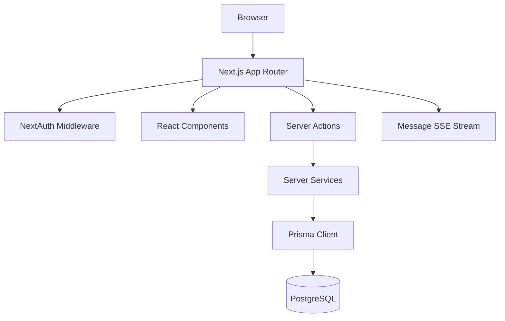
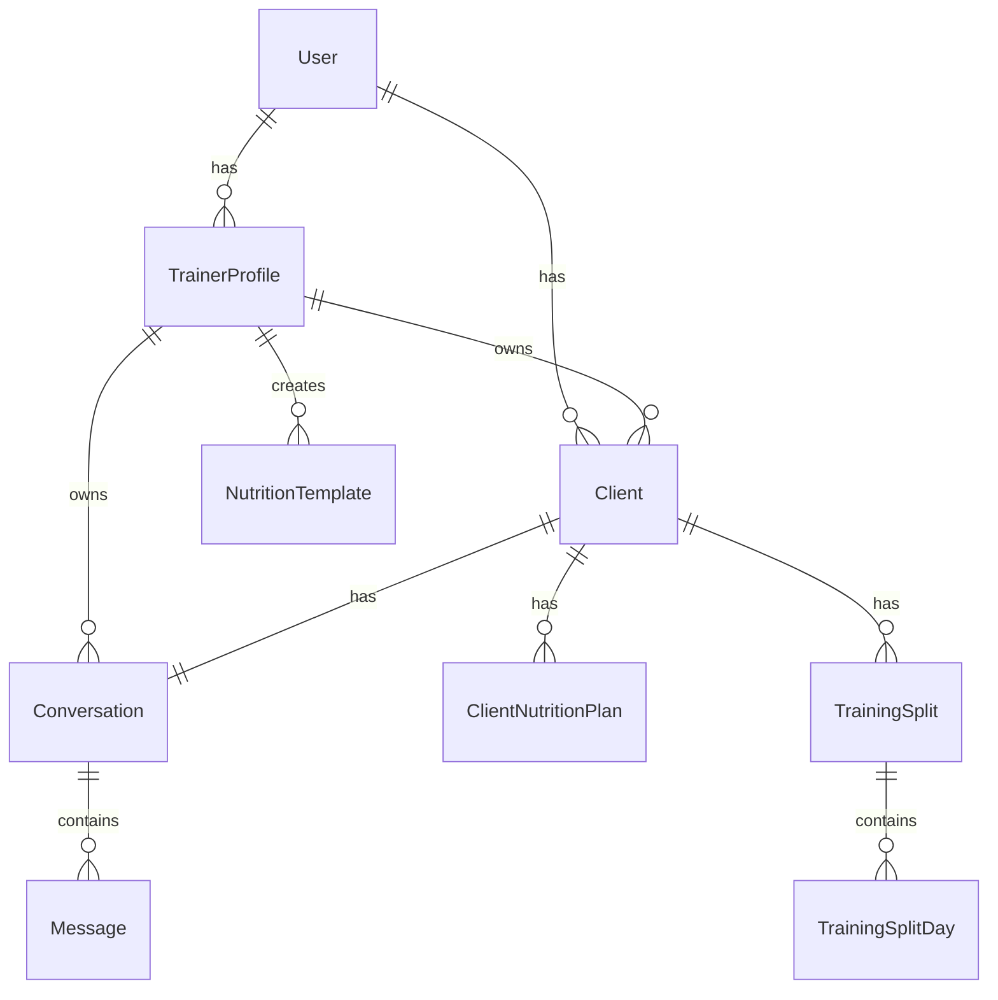
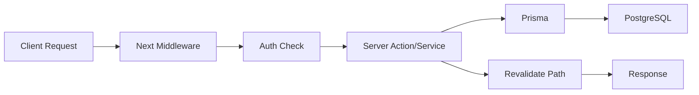

# Technical Documentation

## 1. Project Overview
**What the project does**
Coach is a SaaS platform for personal trainers to manage the full client lifecycle: invite-based onboarding, fitness assessments, nutrition planning, training program delivery, progress tracking, subscriptions and messaging.

**Problem it solves**
Replaces paper records with a scalable digital workflow for trainers who need client onboarding, assessments, nutrition and training templates, progress analytics and subscription management.

**Main users**
* **Trainer** – client management, assessments, nutrition & training templates, progress analytics, subscription sessions, messaging
* **Admin** – global dashboard, trainer/client/subscription overview
* **Client** – invite form, baseline assessment intake, client portal for week/workout/progress/nutrition/profile

High-level summary: Next.js 16 App Router + React 19 + TypeScript SPA with PostgreSQL/Prisma backend, NextAuth credentials, RBAC, i18n ar/en RTL, Server Actions.

## 2. Technology Stack
* Languages: TypeScript 5, SQL
* Frameworks: Next.js 16.3.0 App Router, React 19.2.8
* Runtime: Node.js 18+
* Package manager: npm
* Database: PostgreSQL 15+, Prisma ORM 7.9.1 @prisma/adapter-pg
* Auth: NextAuth.js 4.24.15 credentials provider
* Validation: Zod 4.4.3, React Hook Form 7.84.0 + @hookform/resolvers
* UI: Tailwind CSS 4, shadcn/ui, Radix UI, lucide-react, Recharts 3.10.1
* Theming: next-themes
* Password hashing: bcryptjs
* i18n: custom locale system with cookie persistence, ar default, RTL support
* Testing: Playwright 1.62.1
* Tooling: ESLint 9, TypeScript, tsx

## 3. Project Structure
```
src/
  app/
    (admin)/admin/          # Admin pages
    (trainer)/              # Trainer pages
    (auth)/                 # Login / register
    (portal)/client/        # Client portal
    invite/[token]/         # Public client invite
    api/                    # Route handlers
    layout.tsx
    globals.css
  components/
    features/               # Feature UI
    layout/                 # Sidebar, bottom nav
    providers/              # Session, i18n, Theme
    ui/                     # shadcn primitives
  lib/
    i18n/                   # ar/en messages, config
    validations/            # Zod schemas
    constants/              # Role enum, labels
    calculations/           # BMI/BMR/TDEE
    prisma.ts
    utils.ts
  server/
    actions/                # Server Actions
    auth/                   # NextAuth config
    services/               # Business logic
middleware.ts
prisma/
  schema.prisma
  seed.ts
scripts/
  seed-demo.ts
```

Entry points:
* `src/app/layout.tsx` – Root layout with providers
* `src/app/(auth)/login/page.tsx` – Auth entry
* `src/app/(trainer)/dashboard/page.tsx` – Trainer home
* `src/app/(portal)/client/home/page.tsx` – Client home

## 4. Architecture Overview
System is a monolith Next.js app with App Router.

Request flow:
Client -> Next.js Route Handler / Server Action -> Server Service -> Prisma -> PostgreSQL
Real-time messaging via Server-Sent Events `src/app/api/messages/stream/route.ts` and message bus.

Components:
* Presentation: React Server Components + Client Components
* Business logic: `src/server/services/`
* Data access: Prisma Client
* Auth: NextAuth + Middleware role guard
* i18n: custom provider, cookie `locale`



## 5. Core Modules
**Auth & RBAC**
* `src/server/auth/` – NextAuth config, `getCurrentSession`
* `middleware.ts` – route protection per role
* Roles: ADMIN, TRAINER, CLIENT

**Messages**
* `src/server/services/message.service.ts` – conversation CRUD, unread counts
* `src/server/actions/messages.ts` – `sendMessageAction`, `markMessagesReadAction`
* `src/app/api/messages/unread-count/route.ts` – unread badge API
* `src/components/features/messages/chat-thread.tsx` – chat UI with pending/failed retry, SSE

**Clients & Assessments**
* `src/server/services/client.service.ts`
* Models: User, TrainerProfile, Client, Assessment

**Nutrition**
* `src/server/services/nutrition.service.ts`
* Models: NutritionTemplate, ClientNutritionPlan, Meal, MealItem, SupplementDef, SubstituteGroup

**Training**
* Split templates, TrainingSplit, TrainingSplitDay, SplitDayExercise, Exercise

**Subscriptions**
* `src/server/services/subscription.service.ts`
* Models: SubscriptionPlan, Subscription

**i18n**
* `src/lib/i18n/config.ts` – DEFAULT_LOCALE = "ar"
* Messages: `src/lib/i18n/messages/ar.ts`, `en.ts`

## 6. API Documentation
Base URL: `/api`

Authentication: Session cookie via NextAuth

Key endpoints:
* `GET /api/messages?conversationId=...` – fetch messages
* `POST /api/messages` – not used directly, Server Actions used
* `GET /api/messages/unread-count` – returns `{ count }` per session
* `GET /api/messages/stream?conversationId=...` – SSE stream for new messages
* `GET /api/auth/...nextauth` – NextAuth handlers

Server Actions:
* `sendMessageAction({ body, conversationId, clientId })` – sends message, revalidates paths
* `markMessagesReadAction(conversationId)` – marks opposite-role messages read

Error handling: Zod validation errors returned as `{ ok:false, error }`. Prisma errors caught in services.

## 7. Data Layer
ORM: Prisma 7.9.1
Datasource: PostgreSQL

Key models:
* User { id, username?, phone?, email?, passwordHash, role, mustChangePassword }
* TrainerProfile { id, userId, fullName, phone, units, weekStartDay, inviteSlug, clients[] }
* Client { id, trainerId, userId?, fullName?, status, inviteToken, neckPain... }
* Assessment { id, clientId, ... calculated metrics }
* Conversation { id, trainerId, clientId unique, lastMessageAt, messages[] }
* Message { id, conversationId, senderId, senderRole, body, readAt }

Enums: Role, ClientStatus, Goal, PlanStatus, SplitType, TrainingDayFocus, SubscriptionStatus, PlanType, PaymentStatus, Units

Indexes present on foreign keys and status columns.

Migrations via Prisma Migrate. Seed creates admin user.

## 8. Authentication & Authorization
Method: NextAuth.js Credentials provider
Password hashing: bcryptjs
Session: HttpOnly cookies, single active session enforced
RBAC: Middleware checks role per route group
Data scoping: Trainer can only access own clients via `trainerId` filter in services
Protected routes: `(admin)`, `(trainer)`, `(portal)` groups

## 9. Configuration & Environment Variables
`.env.example` provides template.

Required:
* `DATABASE_URL` – PostgreSQL connection string
* `NEXTAUTH_SECRET` – secret for JWT
* `NEXTAUTH_URL` – base URL
* `ADMIN_USERNAME`, `ADMIN_PASSWORD` – seeded admin credentials
* `POSTGRES_USER`, `POSTGRES_PASSWORD`, `POSTGRES_DB` – for local `.pg` setup

Optional:
* `NODE_ENV`

Config files:
* `next.config.ts`
* `prisma.config.ts`
* `tsconfig.json`
* `tailwind.config` via `components.json`

## 10. Local Setup
Prerequisites: Node.js 18+, PostgreSQL 15+, npm 10+

Steps:
```bash
git clone <repo>
cd coach
npm install
cp .env.example .env
# edit DATABASE_URL etc
npm run db:start
npm run db:migrate
npm run db:seed
npm run seed:demo   # optional demo trainer + 10 clients
npm run dev
```
Open http://localhost:3000

Common errors:
* Prisma Client not generated – run `npm run prisma:generate`
* DB connection refused – ensure `db:start` ran or external Postgres reachable
* NextAuth redirect loop – check `NEXTAUTH_URL`

## 11. Scripts & Commands
From `package.json`:
* `npm run dev` – Next dev with Turbopack
* `npm run build` – production build
* `npm run start` – production server
* `npm run lint` – ESLint
* `npm run typecheck` – `tsc --noEmit`
* `npm run db:migrate` – Prisma migrate dev
* `npm run db:seed` – Prisma seed
* `npm run db:studio` – Prisma Studio
* `npm run db:reset` – migrate reset --force
* `npm run seed:demo` – `tsx scripts/seed-demo.ts`

## 12. Testing
Framework: Playwright for E2E
Location: `src/**/__tests__` or Playwright tests in repo root
Run: `npx playwright test`
No unit test suite documented. Assumption: manual + E2E.

## 13. CI/CD & Deployment
No CI files found. Assumption: Manual deploy.
Docker not present. Local Postgres bundled in `.pg/`.
Deployment target unknown / needs verification.

## 14. External Integrations
* Database: PostgreSQL
* Auth: NextAuth credentials, no OAuth providers configured
* Storage: none documented
* Email/SMS/Payments: none implemented
* AI APIs: none

## 15. Security Notes
* bcrypt password hashing
* HttpOnly session cookies
* CSRF protection via NextAuth
* Zod server-side validation
* RBAC middleware
* Data scoping per trainer
* No secrets committed – use env vars
Possible improvements: rate limiting, CSRF tokens on actions, audit logging, 2FA.

## 16. Performance & Scalability
* Server Components reduce client JS
* Prisma query optimization via indexes
* SSE for messaging, no WebSocket
* No caching layer documented
Risks: N+1 queries in list endpoints, large message history load – use pagination.

## 17. Logging & Monitoring
Logging via Next.js dev logs. No structured logging, monitoring or error tracking configured. Assumption: needs verification.

## 18. Known Limitations
* Real-time badge updates via polling 30s + custom event – no global state manager
* Client bottom nav messages tab added manually – may diverge from design
* No unit tests
* CI/CD not configured
* Duplicate key error in chat-thread when merging pending messages – needs deduplication fix

## 19. Recommendations
* Add React Query / SWR for server state and cache invalidation
* Implement proper message deduplication in `chat-thread.tsx`
* Add rate limiting and audit logs
* Introduce CI pipeline with lint, typecheck, tests
* Add health check endpoint
* Document API with OpenAPI

## 20. Mermaid Diagrams



